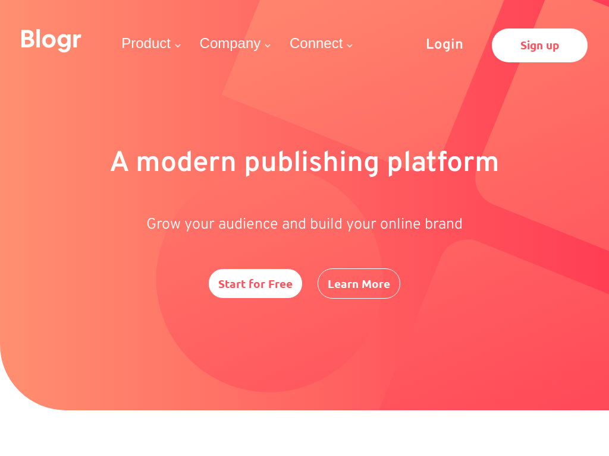

# Frontend Mentor - Blogr landing page solution

This is a solution to the [Blogr landing page challenge on Frontend Mentor](https://www.frontendmentor.io/challenges/blogr-landing-page-EX2RLAApP). 
## Table of contents

- [Overview]
  - [The challenge](#the-challenge)
  - [Screenshot](#screenshot)
  - [Links](#links)
  - [Built with](#built-with)
  - [Author](#author)

### The challenge

Users should be able to:

- View the optimal layout for the site depending on their device's screen size
- See hover states for all interactive elements on the page

### Screenshot

### Links

- Solution URL: [https://www.frontendmentor.io/solutions/blogr-landing-page-SJFsdHdVc](https://www.frontendmentor.io/solutions/blogr-landing-page-SJFsdHdVc)
- Live Site URL: [https://fem-blogr-landing-page-v2.netlify.app/](https://your-live-site-url.com)

### Built with

- Semantic HTML5 markup
- Flexbox
- CSS Grid
- Mobile-first workflow
- Sass
- Javascript

## Author

- Website - [https://abarisic-portfolio.netlify.app/index.html)]
- Frontend Mentor - [https://www.frontendmentor.io/profile/abarisic1509]
- Linkedin - [https://www.linkedin.com/in/ana-marija-bari%C5%A1i%C4%87-3b88b523a/]
